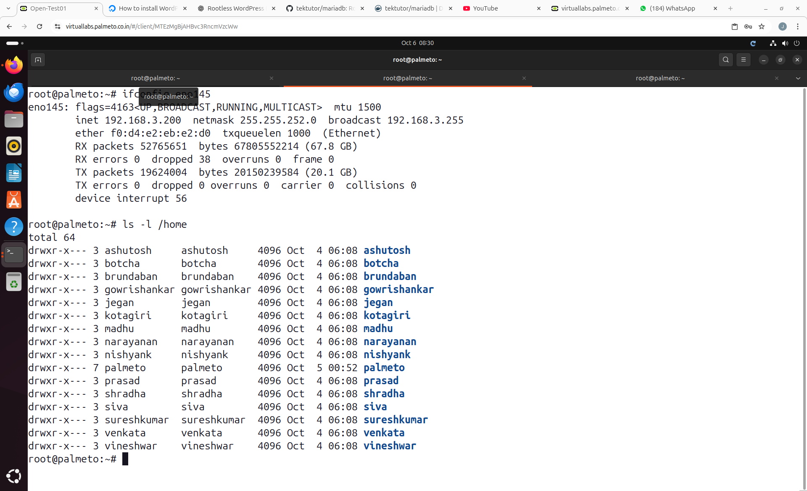
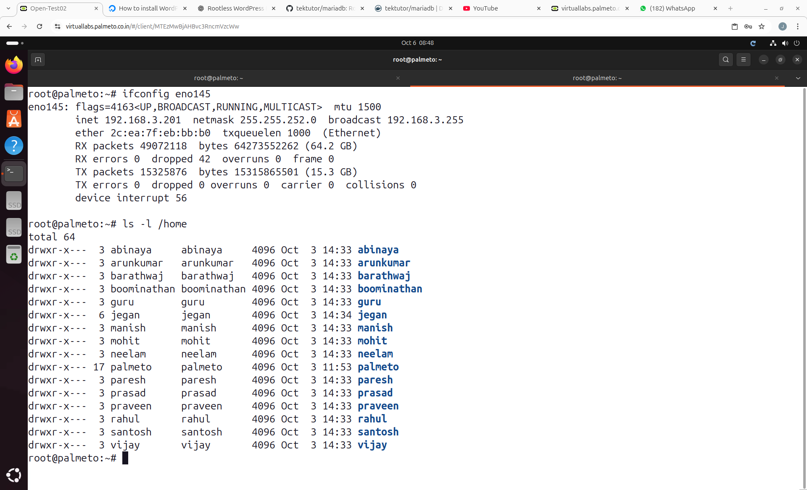

# Red Hat Openshift 6th to 10th Oct 2025

## Server 1 ( 192.168.3.200 )

## Server 2 ( 192.168.3.201 )

## Pre Test
<pre>
https://forms.cloud.microsoft/r/t9ZLUPGe2S  
</pre>

Note
<pre>
- While registering for pre-test, give your full name so that your L&D Team will be able to recognize you
- Do not share your BOFA email, instead use your personal email-id
- Once everyone completes the test, let's proceed with the training
- You don't need to worry if you are not able to answer correctly, this is just to check how much you already about this training content, if you don't know anything you are the ideal participant
- if you are able to answer some or most of them, you are already seem to know about containers, container orchestration, etc.,
- Once you complete the test, kindly notify me
</pre>
